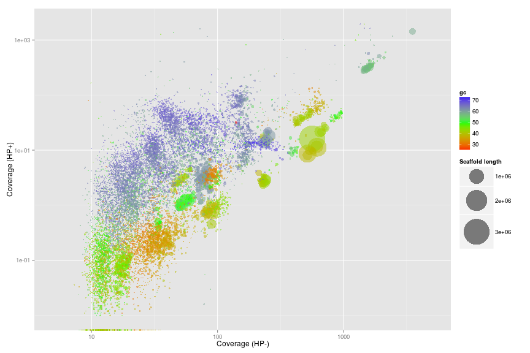
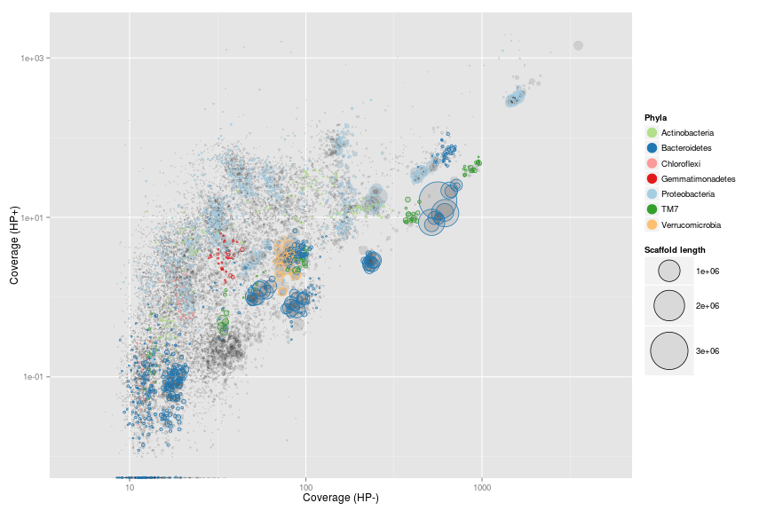
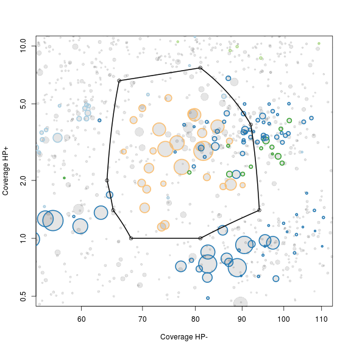
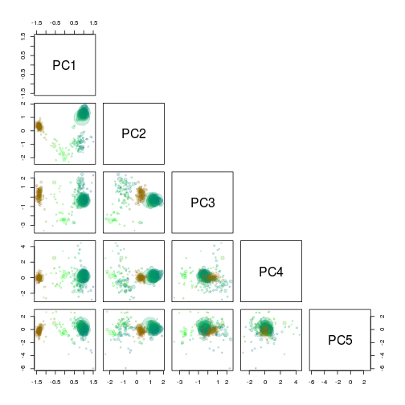
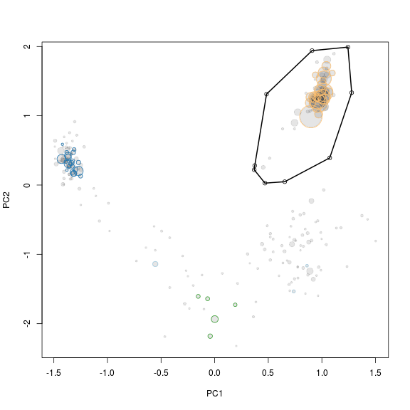

## Introduction
This R tutorial show how to extract individual genome bins from metagenomes, as descibed in Albertsen et al., 2013 (Add link). The guide is written in R markdown and can be found [here](https://github.com/MadsAlbertsen/multi-metagenome/tree/gh-pages/docs).

### Requirements
The guide assumes basic knowledge of [Rstudio](http://www.rstudio.com/) (a powerfull IDE to [R](http://www.r-project.org/)). If you have never used R take a look at the [introduction at code school](http://tryr.codeschool.com/).

The basic data requirement is two metagenomes where the target species are in differential abundance. The data is assembled into 1 assembly (i.e a collection of scaffolds). The raw reads are then mapped independently to the assembly, which generates two `coverage` estimates for each scaffold. The coverage information is then integrated with all other information on each scaffold, i.e. `gc content`, `length`, `kmer frequency` and presence of `essential genes` and their `taxonomic classification`. 

All data except the two coverage estimates (`HPminus` and `HPplus`) can be automatically generated from a fasta file of the assembled scaffolds using the script: `workflow.R.data.generation.sh`, see [Data generation](http://madsalbertsen.github.io/multi-metagenome/docs/step5.html) for detailed information.

The guide uses the original data from the publication.

### Download the R formatted data.

Download and upack the data used in Albertsen et al., 2013. The file is approximately 70 Mb.


download.file(url='https://dl.dropbox.com/s/989dix16ugyuvrq/Albertsen2013.data.tar.gz',destfile='Albertsen2013.data.tar.gz', method = 'wget')
untar('Albertsen2013.data.tar.gz')


### Load needed packages

In case you havn't install all the needed packages, they can be installed via e.g. `install.packages('vegan')`.


R.version$version.string



"R version 3.0.1 (2013-05-16)"



library("vegan")
library("plyr")
library("RColorBrewer")
library("alphahull")
library("ggplot2")


### Read in all the data

The data is read and a few of the data columns are renamed.


HPminus <- read.csv("HPminus.scaffold.coverage.csv", header = T)
HPplus <- read.csv("HPplus.scaffold.coverage.csv", header = T)
gc <- read.delim("assembly.gc.tab", header = T)
kmer <- read.delim("assembly.kmer.tab", header = T)
ess <- read.table("assembly.orfs.hmm.id.txt", header = F)
ess.tax <- read.delim("assembly.orfs.hmm.blast.tax.tab", header = F)
cons.tax <- read.delim("assembly.tax.consensus.txt", header = T)

colnames(kmer)[1] = "name"
colnames(ess) = c("name", "orf", "hmm.id")
colnames(ess.tax) = c("name", "orf", "phylum")
colnames(cons.tax) = c("name", "phylum", "tax.color", "all.assignments")


Merge all data on scaffolds into a single data frame `d`.


d <- as.data.frame(cbind(HPminus$Name, HPplus$Reference.length, gc$gc, HPminus$Average.coverage, 
    HPplus$Average.coverage), row.names = F)
colnames(d) = c("name", "length", "gc", "HPminus", "HPplus")
d <- merge(d, cons.tax, by = "name", all = T)


As the phylum names are a little messy we clean them for more pretty plots later.


d$phylum <- sub("<phylum>", "", d$phylum)
d$phylum <- sub("unclassified Bacteria", "TM7", d$phylum)
d$phylum <- sub("/Chlorobi group", "", d$phylum)
d$phylum <- sub("Chlamydiae/", "", d$phylum)
d$phylum <- sub(" group", "", d$phylum)
d$phylum <- sub("Amoebozoa", NA, d$phylum)
d$phylum <- sub("Opisthokonta", NA, d$phylum)


Merge all data on essential genes into a single data frame `e`.


e <- merge(ess, d, by = "name", all.x = T)
e <- merge(e, ess.tax, by = c("name", "orf"), all.x = T)
e <- e[, -c(10, 11)]


We now have 2 dataframes: `d` which contains all data in the individual **scaffolds** and `e` which contains data on essential genes. We work with 2 seperate dataframes as each scaffold can contain multiple essential genes.

The `d` dataframe contains the following information:


d[7:10, ]



name length    gc HPminus   HPplus         phylum tax.color                all.assignments
   7  37104 43.57  468.75   37.795 Proteobacteria         1  Proteobacteria;Proteobacteria
   8  10449 35.62   30.36    0.187           <NA>        NA                           <NA>
   9   3252 58.35 1951.70 1750.486 Proteobacteria         1                 Proteobacteria
  10  13660 52.53  854.71   33.496     Firmicutes         8          Firmicutes;Firmicutes


Where `name` is the name of the scaffold. `HPminus` is the coverage of the scaffold in the sample HPminus and `HPplus` is the coverage of the scaffold in the sample HPplus. `phylum` is the consensus phylum level assignement of the essential genes found on the scaffold. `tax.color` is a variable used for coloring and is arrange by decreasing number of essential genes. In this case there is most essential genes assigned to proteobacteria, hence it has the `tax.color`of 1. `all.assignments` contains all taxonomic assignments for the essential genes found on the scaffold, seperated by ';'. 

The `e` datafram contains the following information:


e[2:4, ]



   name orf    hmm.id length    gc HPminus HPplus        phylum.x  tax.color
  10010   1 TIGR00418   1325 58.19  135.11  11.39  Proteobacteria          1
 100146   1 TIGR02012   1389 68.06   37.65  20.38  Actinobacteria          3
 100172   3 TIGR00086   3583 66.12   17.99  29.21  Proteobacteria          1


Where `name` is the name of the scaffold and `orf` is the open reading frame within the scaffold. `hmm.id` is the HMM model that was identified in the ORF.

### Define a few functions for later use

To make the subsequent binning more east we define a funtion to calculate basic statistics on a set of scaffolds and call it `calc.genome.stats`.


genome.stats <- matrix(NA, nrow = 0, ncol = 9)
colnames(genome.stats) <- c("total.length", "# scaffolds", "mean.length", "max.length", 
    "gc", "HPminus", "HPplus", "tot.ess", "uni.ess")

calc.genome.stats <- function(x, y) matrix(c(sum(x$length), nrow(x), round(mean(x$length), 
    1), max(x$length), round(sum((x$gc * x$length))/sum(x$length), 1), round(sum((x$HPminus * 
    x$length))/sum(x$length), 1), round(sum((x$HPplus * x$length))/sum(x$length), 
    1), nrow(y), length(unique(y$hmm.id))), dimnames = list(colnames(genome.stats), 
    ""))


We also define a funtion to extract a subset of scaffolds, called `extract`.


extract <- function(x, a.def, v1, v2) {
    out <- {
    }
    for (i in 1:nrow(x)) {
        if (inahull(a.def, c(v1[i], v2[i]))) 
            out <- rbind(out, x[i, ])
    }
    return(out)
}


## Initial overview of the data
The `calc.genome.stats` can be used to calculate basic statistics on the full dataset.


calc.genome.stats(d, e)



total.length 4.231e+08
# scaffolds  1.339e+05
mean.length  3.159e+03
max.length   3.049e+06
gc           5.460e+01
HPminus      8.270e+01
HPplus       2.460e+01
tot.ess      8.311e+03
uni.ess      1.080e+02


`tot.ess` is the total number of essential genes identified, where `uni.ess` is the number of unique essential genes. 

To get an initial overview of the data we only use scaffolds > 5000 bp.


ds <- subset(d, length > 5000)
es <- subset(e, length > 5000)


### Coverage plots - Colored by GC
The basic plot is the **Differential coverage** plot. We simply take all scaffolds and plot the two coverage estimates `HPplus` and `HPminus` against each other. Each circle on the plot is a scaffold, scaled by the length and colored according to GC content. We use the [ggplot2](http://ggplot2.org/) package to plot for easy generation of legends. Clusters of scaffolds with the same color represents putative genome bins.


ggplot(ds, aes(x = HPminus, y = HPplus, color = gc, size = length)) + scale_x_log10(limits = c(5, 
    5000)) + scale_y_log10(limits = c(0.01, 2000)) + xlab("Coverage (HP-)") + 
    ylab("Coverage (HP+)") + geom_point(alpha = 0.5) + scale_size_area(name = "Scaffold length", 
    max_size = 20) + scale_colour_gradientn(colours = c("red", "green", "blue"))


 

### Coverage plots - Colored by phylum level assignment of essential genes
To further underline that the clusters represents putative genome bins we color all scaffolds containing essential genes. Using the `tax.color` variable. 

However to only color scaffolds from the 7 most abundant phyla we have to do a little workaround. The tax.color variable is sorted by abundance. E.g. tax.color = 1 is assigned to the phyla with most scaffolds assigned. Change the `t` parameter to include more or less phyla.


t <- 8
ds$tax.color[is.na(ds$tax.color)] <- 0
for (i in 1:nrow(ds)) {
    if (as.integer(ds$tax.color[i]) < t & as.integer(ds$tax.color[i]) > 0) {
        ds$tax.color[i] <- brewer.pal(8, "Paired")[as.integer(ds$tax.color[i])]
    } else {
        ds$tax.color[i] <- NA
        ds$phylum[i] <- NA
    }
}

pcol <- cbind(unique(ds$tax.color)[-1], unique(ds$phylum)[-1])
pcol <- pcol[order(pcol[, 2]), 1]


Now we can make the plot. It is now even more clear that the clusters do seem to represent putative genome bins.


ggplot(ds, aes(x = HPminus, y = HPplus, size = length, colour = phylum)) + scale_x_log10(limits = c(5, 
    5000)) + scale_y_log10(limits = c(0.01, 2000)) + xlab("Coverage (HP-)") + 
    ylab("Coverage (HP+)") + geom_point(alpha = 0.1, colour = "black") + geom_point(shape = 1) + 
    scale_colour_manual(name = "Phyla", values = pcol) + scale_size_area(name = "Scaffold length", 
    max_size = 20) + guides(colour = guide_legend(override.aes = list(alpha = 1, 
    size = 5, shape = 19)))


 

## Genome extraction
Now for the fun part of actually extracting individual genomes from the metagenome. In this example we wanted to extract the genome related to Verrumicrobia.

### Zoom on the target genome
Use the scaffolds with essential genes as a rough guide for selection of a subset of scaffolds that include the target genome. The non-target scaffolds will be removed in the next step. 

The locater function is used to interactively define a subspace on the plot. As locater is interactive - I've added the points maunally to allow recration of the full guide. The area defined by the selected points is extracted using the ahull function. 


x <- "HPminus"
y <- "HPplus"

plot(ds[, x], ds[, y], log = "xy", cex = sqrt(ds$length)/100, pch = 20, col = rgb(0, 
    0, 0, 0.1), xlim = c(55, 110), ylim = c(0.5, 10), xlab = "Coverage HP-", 
    ylab = "Coverage HP+")

points(ds[, x], ds[, y], cex = sqrt(ds$length)/100 * 0.7, col = ds$tax.color, 
    lwd = 2)

# def<-locator(100, type='p', pch=20)

def <- {
}
def$x <- c(64, 66, 81, 92, 94, 81, 68, 65)
def$y <- c(2, 6.6, 7.7, 3.9, 1.4, 1, 1, 1.4)

g1.selection.A <- ahull(def, alpha = 1e+05)

plot(g1.selection.A, col = "black", add = T)


 

### Extract scaffolds and essential genes

Extract all scaffolds and information on essential genes within the defined subspace using the `extract` function.


g1.s.A <- extract(ds, g1.selection.A, ds[, x], ds[, y])
g1.e.A <- extract(es, g1.selection.A, es[, x], es[, y])


We store the extracted scaffolds in the variable `g1.s.A` and the extracted essential genes in `g1.e.A`.

### Calculate statistics on the extracted scaffolds
Then we use the `calc.genome.stats` function to see the basic statistics of the selected scaffolds.


calc.genome.stats(g1.s.A, g1.e.A)



total.length 9801161
# scaffolds      228
mean.length    42987
max.length    701203
gc              54.9
HPminus         79.1
HPplus           3.2
tot.ess          161
uni.ess          104


As seen on the previous plot we have other bacteria in the extracted scaffolds. This can also be seen as we have more total essential genes (`tot.ess`) than unique essential genes (`uni.ess`). As the majority of the essential genes are single copy genes we expect as many total essential genes as unique essential genes. A total of 100-106 essential genes are needed for a complete genome depending on phylum level conservation.

## PCA on the subset

As there is multiple genomes in the subset we make a PCA on the scaffolds in the subset using [vegan](http://cran.r-project.org/web/packages/vegan/index.html) and store the information in a new variable `g1.s.B`.


rda <- rda(kmer[g1.s.A$name, 2:ncol(kmer)], scale = T)
scores <- scores(rda, choices = 1:5)$sites
#
g1.s.B <- cbind(g1.s.A, scores)
g1.e.B <- merge(g1.e.A, g1.s.B[, c(1, 9:13)], all.x = T, by = "name")


### Decide on which PC's to use
To get an overview of which principal components are most informative we use the pairs function to plot the first 5.


rgb.c <- colorRampPalette(c("red", "green", "blue"))
rgb.a <- adjustcolor(rgb.c(max(d$gc) - min(d$gc)), alpha.f = 0.2)
palette(rgb.a)

pairs(g1.s.B[, 9:13], upper.panel = NULL, col = g1.s.B$gc - min(d$gc), cex = sqrt(g1.s.B$length)/100, 
    pch = 20)


 

###Extract scaffolds using locator
`PC1` and `PC2` seem to seperate our target genome from the other scaffolds and is therefore used for another extraction using the locator function.


x <- "PC1"
y <- "PC2"

plot(g1.s.B[, x], g1.s.B[, y], cex = sqrt(g1.s.B$length)/100, pch = 20, col = rgb(0, 
    0, 0, 0.1), xlab = x, ylab = y)

points(g1.s.B[, x], g1.s.B[, y], cex = sqrt(g1.s.B$length)/100 * 0.7, col = g1.s.B$tax.color, 
    lwd = 1)

# def<-locator(100, type='p', pch=20)

def <- {
}
def$x <- c(0.3740306, 0.4839196, 0.9084907, 1.2431527, 1.2781173, 1.0733242, 
    0.653748, 0.4689347, 0.3690356)
def$y <- c(0.2810738, 1.31294166, 1.94015545, 1.99073721, 1.33317436, 0.39235367, 
    0.04839772, 0.02816501, 0.22037569)

g1.selection.B <- ahull(def, alpha = 1e+05)

plot(g1.selection.B, col = "black", add = T)


 

### Extract the scaffolds
Again the `extract` function is used to retrive the scaffolds in the selected subset. Note that the input to the `extract` function is now the previous selection i.e. `g1.s.B` and `g1.e.B`.


g1.s.C <- extract(g1.s.B, g1.selection.B, g1.s.B[, x], g1.s.B[, y])
g1.e.C <- extract(g1.e.B, g1.selection.B, g1.e.B[, x], g1.e.B[, y])


### Look at the statistics of the extracted scaffolds


calc.genome.stats(g1.s.C, g1.e.C)



total.length   6823444
# scaffolds         59
mean.length     115651
max.length      701203
gc                60.9
HPminus           77.4
HPplus             3.0
tot.ess          106.0
uni.ess          103.0


There are a few duplicated "single copy genes", however in this case it is not due to mulitple species in the bin, but real duplicates in the genome. This can be seen by looking at which genes they are duplicated. In this case it is `PF01795` which is often found in multiple copies, specially in large genomes.


g1.d.C <- g1.e.C[which(duplicated(g1.e.C$hmm.id) | duplicated(g1.e.C$hmm.id, 
    fromLast = TRUE)), ]
g1.d.C[order(g1.d.C$hmm.id), c(1, 3, 8)]



name     hmm.id          phylum
 735 PF01795.14 Verrucomicrobia
2546 PF01795.14 Verrucomicrobia
2546 PF01795.14 Verrucomicrobia
5388 PF01795.14 Verrucomicrobia


## Save the extracted scaffolds

Finally we add the genome statistics to a list and print the name of the scaffolds to a file for further refinement. If you extract multiple genes you can keep track of them by adding them to the `genome.stats` variable.


genome.stats <- rbind(genome.stats, t(calc.genome.stats(g1.s.C, g1.e.C)))
rownames(genome.stats)[nrow(genome.stats)] <- "genome 1"
show(genome.stats)



         total.length # scaffolds mean.length max.length   gc HPminus  HPplus tot.ess uni.ess
genome 1      6823444          59      115652     701203 60.9    77.4       3     106     103



write.table(g1.s.C$name, file = "genome1.txt", quote = F, row.names = F, col.names = F)


